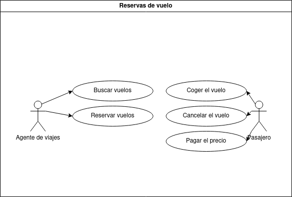

# Enunciado

Crea un diagrama de casos de uso para un sistema de reservas de vuelos. Los actores pueden ser "Pasajero" y "Agente de Reservas". Algunos casos de uso podrían ser "Buscar Vuelo", "Reservar Vuelo", "Cancelar Reserva", etc. Y su especificación.

# Caso a resolver

## Diagrama

### Especificación del caso

### Agente de Reservas:

Este se encarga de buscar los vuelos y reservarlos.
Permite al agente buscar los vuelos y los que sean necesarios reservarlos.

##### Flujo Básico:
El sistema presenta un formulario para buscar las preferencias del cliente.
El agente de reservas completa el formulario y confirma la adición.
El sistema registra la búsqueda y la reserva.

#### Búsquedad de vuelos:

Se analizan las diferentes opciones puestas por cada aerolínea.

##### Flujo Básico:
Se muestra una interfaz para ingresar los datos del lugar a ir, las fechas y con que compañia ir.
   
#### Reserva de vuelos:

Los vuelos aportados por el anterior, el que necesite el cliente se le reservará
##### Flujo Básico:
Cogiendo las preferencias del cliente, el agente cogerá las preferencias plasmadas, como las fechas y sus aportaciones personales y se le generará su reserva

### Pasajero:
#### Coger el vuelo:
El vuelo, ya reservado, el usuario podrá ir y cogerlo.

##### Flujo Básico:
El pasajero aporta sus credenciales en la oficina pertienente.
Aporta sus billetes.
Avanza en el aeropuerto.

#### Cancerlar la reserva:
El pasajero dispondrá de la opción de cancelar el vuelo antes de que suceda, ya sea cualquier motivo que disponga.

##### Flujo Básico:
El sistema dispondrá de una opción, a disposición de cada pasajero, para cancelar los vuelos, previamente reservados. 
El pasajero, dispone los motivo y le da aceptar.
El sistema generará una resolución según los motivos.
